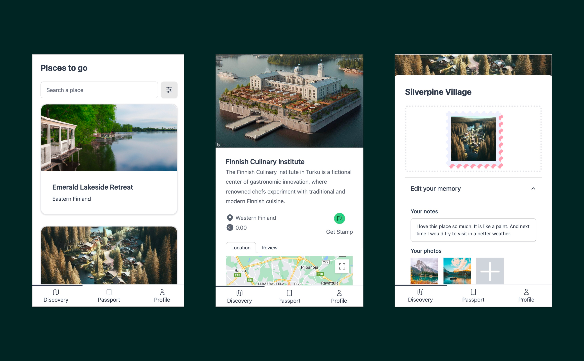
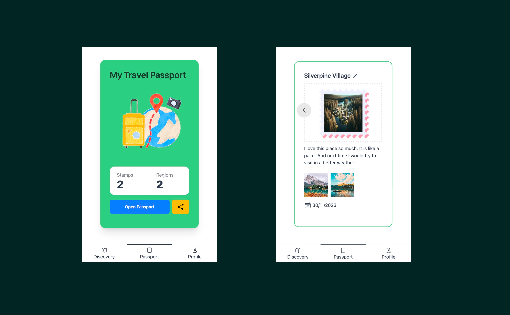

# Digital Travel Passport
Explore local treasures effortlessly and immortalize your travel adventures. It is an application helps travlers to discover hidden gems and allows them to capture the journey through photos and journal entries.

A application for CS-E4400 - Design of WWW Services D, Lecture, 5.9.2023-11.10.2023

## Technologies
- [React.js](https://react.dev/)
- [Vite.js](https://vitejs.dev/)
- [TailwindCSS](https://tailwindcss.com/docs/installation)
- [daisyUI](https://daisyui.com/)
- [Auth0](https://auth0.com/)

## How to start the frontend project
After cloning this project on your local environment, install the dependencies:
```
npm install
```

create a `.env` file in the root of the project, fill out the information.

```
VITE_APP_AUTH0_DOMAIN=YOUR_AUTH0_DOMAIN
VITE_APP_AUTH0_CLIENT_ID=YOUR_AUTH0_CLIENT_ID
VITE_APP_AUTH0_CALLBACK_URL=YOUR_AUTH0_CALLBACK_URL
VITE_APP_AUTH0_AUDIENCE=AUTH0_AUDIENCE
VITE_APP_API_SERVER_URL=BACKEND_API_SERVER_UR
VITE_APP_GOOGLE_MAP_API_KEY=GOOGLE_MAP_API_KEY
```


start the frontend service by running:
```
npm run start
```

At last, open localhost:3000 on browser to preview the frontend page, and when you interact with the page, you can fine it call backend API using another domain localhost:8000

## Project of the backend part
[backend code](https://github.com/jparta/DigitalPassport)

## What it looks like


